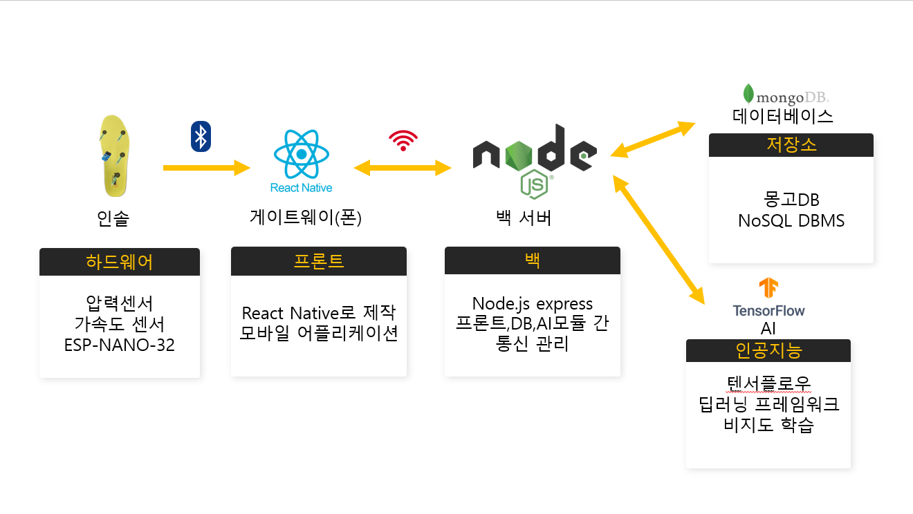

# CatchMe  
🚀 스마트 인솔 기반 치매·뇌질환 예측 플랫폼

---

## 📌 프로젝트 개요
- **프로젝트명:** CatchMe  
- **목적:** 보행 패턴 분석을 통해 초기 치매 및 뇌질환 가능성을 **조기 예측**하는 스마트 인솔 플랫폼 구축  
- **핵심 가치:** 병원 방문/비용 부담 없이 **일상 속 데이터**로 위험 신호를 빠르게 포착

---

## 🔍 문제 인식
- **고령 인구 증가**로 치매 발병률이 높아지는 상황  
- **초기 진단 장벽**(시간·비용·접근성)으로 조기 대응이 어려움

---

## 💡 솔루션
- **스마트 인솔:** 압력·가속도 센서로 **보행 데이터 실시간 수집**  
- **모바일 앱:** React Native 기반 **시각화/자가 문진** 제공  
- **서버 & AI:** Node.js/Express API → MongoDB 저장 → **Python(TensorFlow) 분석** → 보호자 **푸시 알림**

---

## 🔄 시스템 아키텍처
  
> 스마트 인솔 → 모바일 앱 → 서버 → AI 모델로 이어지는 데이터 처리·분석 흐름

---

## 🚀 주요 기능
- **데이터 수집:** 인솔 센서 데이터 수집/전송(자이로·가속도·압력)  
- **자가 문진:** 인지 기능 자가 진단 설문  
- **AI 예측 알림:** 이상 징후 시 **Firebase 푸시 알림(보호자 대상)**  
- **병원 안내:** 위치 기반 주변 병원 추천(API 연동)  

---

## 🛠️ 기술 스택

### Backend (Server-side)
- **런타임/프레임워크:** Node.js, Express.js  
- **DB/ODM:** MongoDB + Mongoose  
- **인증:** `express-session`(세션 기반 로그인), `bcrypt`(비밀번호 해시), **Kakao OAuth 2.0**  
- **AI/데이터 처리:** `child_process`(Python 스크립트 실행), `json2csv`(대용량 센서 JSON → CSV 변환)  
- **외부 서비스:** **Firebase Admin SDK**(FCM 푸시), **Kakao APIs**(소셜/지도), **Naver SMTP**(인증 메일)  
- **유틸:** `dotenv`, `axios`, `uuid`, `express-async-handler`

---

## 왜 이 기술을 썼나요? (의사결정 포인트)
1. **Polyglot 아키텍처**: 웹 요청/세션/라우팅은 **Node.js**, 수치연산·모델추론은 **Python**으로 **역할 최적화**  
2. **세션 기반 인증**: 모바일/웹 혼합 환경에서 **간단하고 신뢰성 있는 로그인 상태 관리**(쿠키+서버 세션)  
3. **푸시 알림(FCM)**: 위험 신호를 **실시간**으로 보호자에게 전달하는 **핵심 UX**  
4. **CSV 저장 전략**: 시계열 Raw 데이터를 DB에 그대로 넣지 않고 **파일+메타데이터**로 분리 → **DB 부하 최소화 & 재학습 용이**

---

## 📝 핵심 로직 및 중요한 코드 발췌

### 1) 세션(Session) 로그인 관리 — 일반 이메일
```jsx
// controllers/authController.js
// ... 비밀번호 비교 성공 후 ...
// 로그인 시 세션에 사용자 ID 저장
req.session.userId = user._id; // ✅ 세션 객체에 userId 기록
console.log('email login success');
res.send('로그인 성공');
```

### 2) 세션(Session) 로그인 관리 — Kakao 소셜
```jsx
// controllers/kakaoLoginController.js
// ... 카카오에서 사용자 정보 획득 후 ...
const user = await findOrCreateUser(kakaoId, name, ageRange, gender);

// 세션에 사용자 정보 저장 (일반 로그인과 동일)
req.session.userId = user._id; // ✅ 카카오 사용자도 세션으로 통합 관리
console.log('kakaoLogin success');
res.redirect("/memberinfo");
```

### 3) 접근 보호 미들웨어
```jsx
// middlewares/authMiddleware.js
exports.requireLogin = (req, res, next) => {
  if (!req.session.userId) {
    return res.status(401).send('로그인이 필요합니다.');
  }
  next();
};
```

### 4) Firebase(FCM) — 보호자 기기 토큰 저장
```jsx
// controllers/alarmController.js
const savePushToken = asyncHandler(async (req, res) => {
  const userId = req.session.userId; // 현재 로그인한 보호자
  const user = await User.findById(userId);
  user.pushToken = req.body.token;   // ✅ 보호자 기기 토큰 저장
  await user.save();
  return res.status(200).json({ message: 'Push token updated' });
});
```
### 5) Firebase(FCM) — 이벤트 트리거 시 알림 발송
```jsx
// controllers/pythonController.js
// ... AI 분석 로직 중 ...
if (result === 0) { // 비정상
  await sendPushNotification(
    userId,
    '긴급 알림',
    '환자의 상태가 비정상입니다. 즉시 확인하세요.'
  );
}
```
```
// controllers/alarmController.js
const sendPushNotification = asyncHandler(async (userId, title, body) => {
  const user = await User.findById(userId);           // 1) 환자
  const guardian = await User.findById(user.contactId); // 2) 보호자
  const target_token = guardian.pushToken;            // 3) 보호자 기기 토큰

  const message = { notification: { title, body }, token: target_token };
  await admin.messaging().send(message);              // 4) Firebase로 전송
  console.log('Successfully sent message');
});
```
### 6) Node ⇄ Python 모델 연동
```jsx
// services/runPythonService.js
const { spawn } = require('child_process');

const runPythonScript = () => new Promise((resolve, reject) => {
  const pythonProcess = spawn('python3', ['./test.py']);
  pythonProcess.stdout.on('data', d => resolve(d.toString().trim()));
  pythonProcess.stderr.on('data', e => reject(new Error(e.toString().trim())));
});
```
### 7) Raw 데이터 CSV 변환·저장
```jsx
// services/rawDataService.js
const { v4: uuidv4 } = require('uuid');
const { parse } = require('json2csv');

exports.saveRawDataToLocal = async (userId, dataArray) => {
  // 1) 두 센서 데이터 결합
  const combinedData = dataArray.gyroAccelData.map((g, i) => ({
    gyroAccelData: g,
    pressureData: dataArray.pressureData[i] || 0
  }));

  // 2) CSV 변환
  const fields = ['gyroAccelData', 'pressureData'];
  const csv = parse(combinedData, { fields });

  // 3) 사용자별 디렉터리 + 고유 파일명 저장
  const dirPath = path.join(__dirname, '../rawDataStorage', userId);
  if (!fs.existsSync(dirPath)) fs.mkdirSync(dirPath, { recursive: true });
  const filePath = path.join(dirPath, `${uuidv4()}.csv`);
  fs.writeFileSync(filePath, csv);
  return filePath;
};
```
### 8) QR로 사용자–보호자 연결
```jsx
// controllers/roleController.js
// QR용 데이터 제공
const giveQrCodeInfo = asyncHandler(async (req, res) => {
  const userId = req.session.userId;
  return res.status(200).json({ qrData: `${userId}` }); // ✅ QR에 담길 사용자 ID
});

// 스캔 후 연결
const linkGuardianAndUser = asyncHandler(async (req, res) => {
  const userId = req.body.userId;        // 스캔된 사용자 ID
  const guardianId = req.session.userId; // 현재 로그인한 보호자
  // ... 두 계정의 contactId를 서로 연결 ...
  return res.status(200).json({ message: 'Guardian and User linked successfully' });
});
```

---
## 👤 내 역할
- 서버 아키텍처 설계, API 설계/구현, 세션·소셜 로그인 통합  
- MongoDB 스키마 설계 및 데이터 파이프라인 구축(JSON → CSV)  
- Python 모델 연동 및 FCM 알림 파이프라인 구현  

---

## ✅ 성과 및 학습
- 보행 데이터 파이프라인(수집 → 가공 → 분석 → 알림) 완성  
- Node.js ⇄ Python 비동기 연동 경험 강화  
- Git 기반 협업 및 Conflict 해결 프로세스 숙련  


